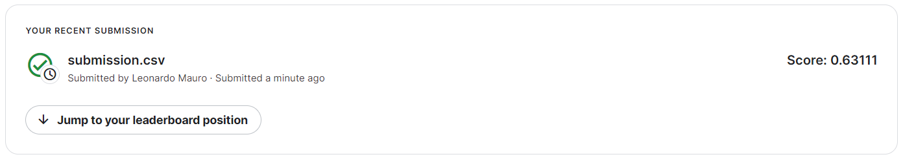

# NLP Pipeline using DVC and Luigi

[](https://github.com/leomaurodesenv/dvc-luigi-nlp)
[](LICENSE)
[](https://github.com/leomaurodesenv/dvc-luigi-nlp/actions/workflows/continuous-integration.yml)


This is a project study to create a NLP pipeline using DVC and Luigi. The pipeline consists of several tasks that process text data, including preprocessing, feature extraction, and model training. Each task is defined as a [Luigi task](https://luigi.readthedocs.io/), which allows for easy tracking of dependencies and parallel execution. The pipeline also uses [DVC](https://dvc.org/) to manage data versioning and ensure reproducibility. The resulting model can be used for text classification or other NLP tasks.

> Note: This project contains a top-50 solution on the competition.

<p align="center"></p>

---
## Code

Download or clone this repository.

### Data

1. Setup your [Kaggle API](https://github.com/Kaggle/kaggle-api) to download the data.
3. Now, you can run the code using `luigi`!

### Running

```shell
## Create a Python environment
$ python -m venv .venv
$ source .venv/bin/activate

## Install requirements
$ pip install -r src/requirements.txt
## Install pre-commit [optional for development]
$ pre-commit install

## Download the dataset
$ kaggle competitions download -c sentiment-analysis-on-movie-reviews -p data

## Running
$ cd source && python -m luigi --module model Predict --local-scheduler
## Output:
# DEBUG: Checking if Predict() is complete
# INFO: Informed scheduler that task   Predict__99914b932b   has status   PENDING
# INFO: Informed scheduler that task   TrainModel__99914b932b   has status   PENDING
# INFO: Informed scheduler that task   Preprocessing__99914b932b   has status   PENDING
# [...]
# INFO: Done scheduling tasks
# INFO: Running Worker with 1 processes
# DEBUG: Asking scheduler for work...
# DEBUG: Pending tasks: 4
# INFO: [pid 13975] Worker Worker(salt=677210727, workers=1, host=CL-PE08WLYF, username=leonardo-moraes, pid=13975) running   ExtractRawData()
# INFO: [pid 13975] Worker Worker(salt=677210727, workers=1, host=CL-PE08WLYF, username=leonardo-moraes, pid=13975) done      ExtractRawData()
# DEBUG: 1 running tasks, waiting for next task to finish
# INFO: Informed scheduler that task   ExtractRawData__99914b932b   has status   DONE
# DEBUG: Asking scheduler for work...
# DEBUG: Pending tasks: 3
# INFO: [pid 13975] Worker Worker(salt=677210727, workers=1, host=CL-PE08WLYF, username=leonardo-moraes, pid=13975) running   Preprocessing()
# INFO: [pid 13975] Worker Worker(salt=677210727, workers=1, host=CL-PE08WLYF, username=leonardo-moraes, pid=13975) done      Preprocessing()
# DEBUG: 1 running tasks, waiting for next task to finish
# INFO: Informed scheduler that task   Preprocessing__99914b932b   has status   DONE
# DEBUG: Asking scheduler for work...
# [...]
```

---
## Also look ~

-   License [MIT](LICENSE)
-   Created by [leomaurodesenv](https://github.com/leomaurodesenv/)
